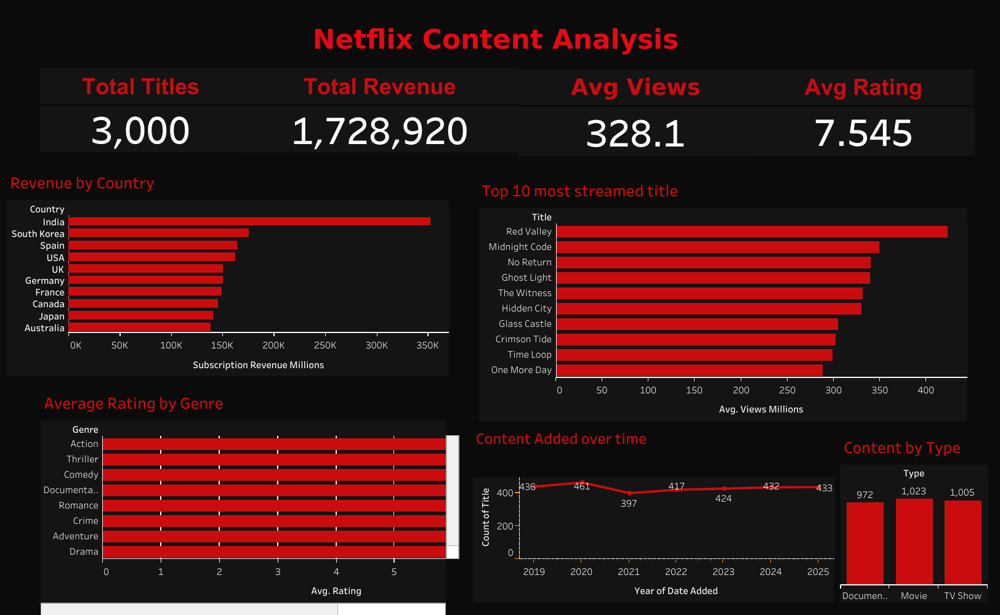

# -Netflix-Content-Performance-Analysis
## Project Overview
This project analyzes a Netflix-style content dataset containing movies, TV shows, and documentaries across multiple countries. The goal is to explore content trends, audience engagement, and revenue patterns using SQL, Tableau, and Google Sheets.

## Tools Used
- SQL
- Tableau
- Google Sheets

## Dataset
The dataset includes:
- Title
- Type
- Genre
- Country
- Release Year
- Rating
- Duration
- Views (Millions)
- Top 10 Indicator
- Subscription Revenue (Millions)
- Date Added

## Objectives
The project was designed to answer key business questions such as:
- Which countries generate the highest revenue?
- Which genres have the highest average ratings?
- What type of content performs best?
- What are the most streamed titles?
- How has content volume changed over time?

## Project Steps
1. Cleaned and reviewed the raw dataset
2. Imported data into SQL for querying
3. Performed exploratory and business analysis
4. Created dashboard views in Tableau
5. Used Google Sheets for formulas, pivot tables, and quick summaries

## Key Insights
- TV Shows and Movies make up the majority of the content catalog
- Some countries contribute significantly more content and revenue than others
- Top 10 titles tend to have higher average views and stronger revenue performance
- Genre performance varies by country and content type
- Content additions show growth trends over time

## Repository Structure
```text
data/
sql/
google-sheets/
tableau/
visuals/
docs/



## 🔗 Links
- Tableau Dashboard: (https://public.tableau.com/views/NetflixDataAnalysis_17750239617340/Dashboard?:language=en-US&:sid=&:redirect=auth&:display_count=n&:origin=viz_share_link)
- GitHub Repo: (https://github.com/alicepatel071103-byte/-Netflix-Content-Performance-Analysis.git)
